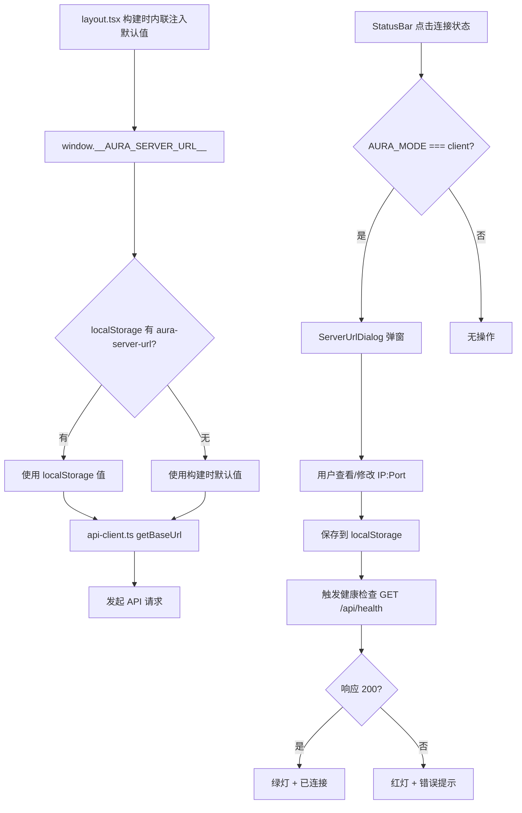

# 客户端运行时切换服务器地址 — 实施方案

## 1. 可行性结论：✅ 完全可行

| 维度 | 评估 |
|------|------|
| 技术可行性 | 高。`localStorage` + 构建时默认值 fallback，Tauri WebView2 原生支持持久化 |
| 改动范围 | 极小。4 个文件（2 新建 + 2 修改），无新增依赖 |
| 向后兼容 | 完全兼容。未设置自定义地址时行为与现在一致 |
| 风险等级 | 低。即使 localStorage 被清除，自动回退构建时默认值 |

---

## 2. 核心策略

```
优先级链：localStorage 自定义地址 > Next.js 构建时注入的 __AURA_SERVER_URL__ > 硬编码兜底
```



---

## 3. 改动文件清单

| # | 文件 | 操作 | 说明 |
|---|------|------|------|
| 1 | [`src/lib/server-url.ts`](web-aura-next/src/lib/server-url.ts) | **新建** | 封装 `getServerUrl()` / `setServerUrl()` / `resetServerUrl()`，统一读写入口 |
| 2 | [`src/lib/api-client.ts`](web-aura-next/src/lib/api-client.ts) | 修改 | `getBaseUrl()` 调用 `getServerUrl()` 替代直接读 `window.__AURA_SERVER_URL__` |
| 3 | [`src/components/layout/ServerUrlDialog.tsx`](web-aura-next/src/components/layout/ServerUrlDialog.tsx) | **新建** | 弹窗组件：当前地址、编辑框、格式校验、连接测试、恢复默认 |
| 4 | [`src/components/layout/StatusBar.tsx`](web-aura-next/src/components/layout/StatusBar.tsx) | 修改 | 连接状态区域添加 `onClick` → 打开 `ServerUrlDialog`，`getHealthUrl()` 调用 `getServerUrl()` |
| 5 | [`deploy/build-client-lan.bat`](deploy/build-client-lan.bat) | 修改 | 构建完成提示：告知用户运行时也可点击状态栏换地址 |

---

## 4. 详细设计

### 4.1 `src/lib/server-url.ts`（新建）

```typescript
// localStorage key
const STORAGE_KEY = "aura-server-url";

/** 获取当前生效的服务端地址 */
export function getServerUrl(): string {
  // 1. 优先读 localStorage 中的用户自定义地址
  if (typeof window !== "undefined") {
    const custom = localStorage.getItem(STORAGE_KEY);
    if (custom) return custom;
  }

  // 2. fallback 到构建时注入的默认值
  if (typeof window !== "undefined") {
    const win = window as unknown as Record<string, unknown>;
    if (win.__AURA_SERVER_URL__) {
      return win.__AURA_SERVER_URL__ as string;
    }
  }

  // 3. 最终兜底
  return "http://localhost:8086";
}

/** 设置自定义服务端地址（保存前校验格式） */
export function setServerUrl(url: string): { ok: boolean; error?: string } {
  // URL 格式校验
  try {
    const parsed = new URL(url);
    if (!["http:", "https:"].includes(parsed.protocol)) {
      return { ok: false, error: "地址必须以 http:// 或 https:// 开头" };
    }
    if (!parsed.hostname) {
      return { ok: false, error: "请输入有效的服务器地址" };
    }
  } catch {
    return { ok: false, error: "地址格式不正确，示例: http://192.168.1.100:8086" };
  }

  localStorage.setItem(STORAGE_KEY, url);
  return { ok: true };
}

/** 恢复为构建时默认地址 */
export function resetServerUrl(): void {
  localStorage.removeItem(STORAGE_KEY);
}

/** 是否有用户自定义地址 */
export function hasCustomServerUrl(): boolean {
  if (typeof window === "undefined") return false;
  return localStorage.getItem(STORAGE_KEY) !== null;
}
```

### 4.2 `src/lib/api-client.ts`（修改）

```diff
- function getBaseUrl(): string {
-   const mode = getAuraMode();
-   if (mode === "client") {
-     if (typeof window !== "undefined") {
-       const win = window as unknown as Record<string, unknown>;
-       return (win.__AURA_SERVER_URL__ as string) || (process.env.AURA_SERVER_URL as string) || "http://localhost:8086";
-     }
-     return "http://localhost:8086";
-   }
-   return "";
- }
+ import { getServerUrl } from "./server-url";
+
+ function getBaseUrl(): string {
+   const mode = getAuraMode();
+   if (mode === "client") {
+     return getServerUrl();
+   }
+   return "";
+ }
```

### 4.3 `src/components/layout/ServerUrlDialog.tsx`（新建）

**Props:**
- `open: boolean`
- `onClose: () => void`
- `onUrlChanged: () => void` — 地址变更后回调，用于触发 StatusBar 重新检查连接

**UI 结构:**
```
┌─────────────────────────────────────┐
│  🔗 服务端连接设置                    │
│  ─────────────────────────────────  │
│                                      │
│  当前地址                            │
│  ┌─────────────────────────────────┐ │
│  │ http://192.168.1.100:8086       │ │
│  └─────────────────────────────────┘ │
│                                      │
│  ┌─ 测试连接 ─┐  ┌─ 恢复默认 ─┐     │
│  └────────────┘  └────────────┘     │
│                                      │
│  状态: ✅ 连接成功 / ❌ 无法连接      │
└─────────────────────────────────────┘
```

**交互逻辑:**
1. 打开时展示当前生效地址（调用 `getServerUrl()`）
2. 输入框支持直接编辑
3. 点击外围或关闭按钮 → `onClose()`
4. 编辑后自动保存到 localStorage（失焦即保存），也可加一个显式"保存"按钮
5. "测试连接"按钮：用新地址发 `GET /api/health`，显示结果
6. "恢复默认"按钮：调用 `resetServerUrl()`，输入框恢复为默认地址
7. 保存成功后调用 `onUrlChanged()` 通知 StatusBar 刷新

### 4.4 `src/components/layout/StatusBar.tsx`（修改）

```diff
+ import { getServerUrl } from "@/lib/server-url";
+ import { ServerUrlDialog } from "./ServerUrlDialog";

- function getHealthUrl(): string {
-   if (typeof window !== "undefined") {
-     const win = window as unknown as Record<string, unknown>;
-     if (win.__AURA_MODE__ === "client") {
-       const serverUrl =
-         (win.__AURA_SERVER_URL__ as string) || "http://localhost:8086";
-       return `${serverUrl}/api/health`;
-     }
-   }
-   return "/api/health";
- }
+ function getHealthUrl(): string {
+   const mode = getAuraMode();
+   if (mode === "client") {
+     return `${getServerUrl()}/api/health`;
+   }
+   return "/api/health";
+ }

export function StatusBar() {
  const [time, setTime] = useState("");
  const [connected, setConnected] = useState<boolean | null>(null);
+ const [dialogOpen, setDialogOpen] = useState(false);
+ const auraMode = getAuraMode();

  const checkHealth = useCallback(async () => { ... }, []);

+ const handleUrlChanged = useCallback(() => {
+   checkHealth();
+ }, [checkHealth]);

  return (
    <footer ...>
-     <div className="flex items-center gap-2">
+     <div
+       className={`flex items-center gap-2 ${auraMode === "client" ? "cursor-pointer hover:text-aura-text transition-colors" : ""}`}
+       onClick={() => auraMode === "client" && setDialogOpen(true)}
+       title={auraMode === "client" ? "点击设置服务端地址" : undefined}
+     >
        <span className={`inline-block w-2 h-2 rounded-full ${...}`} />
        <span>{connected === null ? "检测中..." : connected ? "已连接" : "未连接"}</span>
      </div>
      <div>{time}</div>
+     {auraMode === "client" && (
+       <ServerUrlDialog
+         open={dialogOpen}
+         onClose={() => setDialogOpen(false)}
+         onUrlChanged={handleUrlChanged}
+       />
+     )}
    </footer>
  );
}
```

### 4.5 `deploy/build-client-lan.bat`（修改）

在构建完成提示中增加一行说明：

```diff
  echo   💡 如果部署到不同服务器，请:
- echo       1. 修改 web-aura-next\.env.lan 中的 AURA_SERVER_URL
- echo       2. 重新运行本脚本
+ echo       方式一（推荐）：启动客户端后，点击左下角连接状态，直接修改服务器地址
+ echo       方式二（重新打包）：修改 web-aura-next\.env.lan 中的 AURA_SERVER_URL，重新运行本脚本
```

---

## 5. 关键设计决策

| 决策点 | 选择 | 原因 |
|--------|------|------|
| 存储方案 | `localStorage` | 零依赖，Tauri WebView2 原生持久化，清除后自动回退默认值 |
| 触发方式 | 点击 StatusBar 连接状态 | 直观、不占额外 UI 空间，与连接状态语义强关联 |
| 模式限制 | 仅 `AURA_MODE=client` 可编辑 | 服务端模式下服务器就是自己，换地址无意义 |
| 保存时机 | 输入框失焦 + 显式保存按钮 | 防止用户输一半就触发了不完整的 URL 请求 |
| URL 校验 | 前端 `new URL()` 格式校验 + 保存后立即 health check | 双重保障，格式错误即时提示，连通性异步验证 |
| 旧 Cookie 处理 | 切换地址后不清除 Cookie | Cookie 绑域名，换了服务器地址后旧 Cookie 自动不发送；如需清除可手动在弹窗加提示 |

---

## 6. 潜在扩展（本次不做）

- 支持多个预设服务器地址快速切换（下拉列表）
- 客户端首次启动时"配置向导"引导输入服务器地址
- 支持从配置文件（如 `aura-config.json`）读取服务器地址
