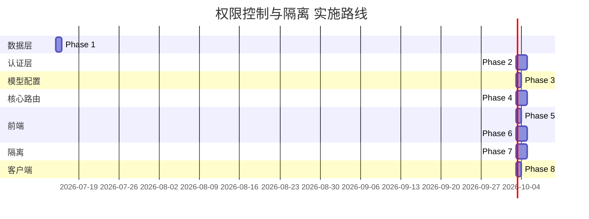

# Aura 权限控制与隔离 — 实施计划

> **上游 PRD**：[`docs/权限控制与隔离PRD.md`](权限控制与隔离PRD.md)
> **状态**：📋 待实施
> **创建时间**：2026-07-15

---

## 总览：双端异构权限模型

| 维度 | 🌐 Web 服务端 (多用户 SaaS) | 💻 桌面客户端 (单机免登) |
|---|---|---|
| **准入门槛** | 必须登录 (JWT) | 免登录 |
| **API Key 来源** | `aura_db.user_model_configs` (加密存储) | 请求 Header `X-Aura-Local-Key` (用完即焚) |
| **资产归属** | 强绑定 `user_id` | 属于当前操作系统用户 |
| **工作空间路径** | `DATA_ROOT/workspaces/user_{id}/{workspaceId}` | 客户端本地绝对路径 |

---

## Phase 1 — 数据库 Schema 升级

### 1.1 新增 `users` 表

文件：[`web-aura-next/src/lib/db/schema/index.ts`](../web-aura-next/src/lib/db/schema/index.ts)

```typescript
// users 表：极简账户系统
export const users = pgTable("users", {
  id: serial("id").primaryKey(),
  username: varchar("username", { length: 100 }).notNull().unique(),
  passwordHash: varchar("password_hash", { length: 255 }).notNull(), // bcrypt hash
  displayName: varchar("display_name", { length: 100 }),
  createTime: timestamp("create_time", { withTimezone: true }).defaultNow().notNull(),
  updateTime: timestamp("update_time", { withTimezone: true }).defaultNow().notNull(),
});
```

### 1.2 新增 `user_model_configs` 表

```typescript
export const userModelConfigs = pgTable(
  "user_model_configs",
  {
    id: uuid("id").defaultRandom().primaryKey(),
    userId: integer("user_id").notNull().references(() => users.id, { onDelete: "cascade" }),
    label: varchar("label", { length: 100 }).notNull(),          // 用户自定义标签
    modelName: varchar("model_name", { length: 100 }).notNull(), // 实际模型名
    apiKeyEncrypted: text("api_key_encrypted").notNull(),        // AES 加密后的 Key
    baseUrl: text("base_url").default("https://api.deepseek.com/v1"),
    isDefault: boolean("is_default").default(false),
    createTime: timestamp("create_time", { withTimezone: true }).defaultNow().notNull(),
    updateTime: timestamp("update_time", { withTimezone: true }).defaultNow().notNull(),
  },
  (table) => ({
    userIdIdx: index("idx_user_model_configs_user_id").on(table.userId),
    uniqueUserLabel: uniqueIndex("uidx_user_label").on(table.userId, table.label),
  })
);
```

### 1.3 已有表增加 `user_id` 字段

| 表 | 变更 |
|---|---|
| `workspaces` | 新增 `user_id INTEGER REFERENCES users(id)`，添加索引 |
| `chatMessages` | 新增 `user_id INTEGER REFERENCES users(id)`，添加索引 |
| `agentKnowledge` | 新增 `user_id INTEGER REFERENCES users(id)`，添加索引 |

### 1.4 迁移执行

```bash
cd web-aura-next
npm run db:generate   # 自动生成版本化 SQL
npm run db:migrate    # 执行迁移
```

---

## Phase 2 — Auth 认证层

### 2.1 Auth 工具库

**新文件**：[`web-aura-next/src/lib/auth/index.ts`](../web-aura-next/src/lib/auth/index.ts)

职责：
- `hashPassword(plain: string): Promise<string>` — bcrypt 哈希
- `verifyPassword(plain: string, hash: string): Promise<boolean>` — 密码验证
- `signJWT(userId: number): string` — 签发 JWT (HS256, 7天过期)
- `verifyJWT(token: string): { userId: number } | null` — 验证 & 解析 JWT
- `getAuthenticatedUser(req: Request): { userId: number } | null` — 从 Cookie/Header 提取 JWT 并验证，返回 `userId`
- `AUTH_COOKIE_NAME = "aura_token"`

> 使用 `jose` 库避免 `jsonwebtoken` 体积过大的问题。需 `npm install jose bcryptjs`。

### 2.2 注册模式

> **开放注册**：任何人访问登录页即可自行注册账号，无需管理员审批。适合轻量内部工具，零管理成本。

### 2.3 登录 API

**新文件**：[`web-aura-next/src/app/api/auth/login/route.ts`](../web-aura-next/src/app/api/auth/login/route.ts)

```
POST /api/auth/login
Body: { username: string, password: string }

Response:
  200 → { code: 200, message: "ok", data: { token: string, user: { id, username, displayName } } }
  401 → { code: 401, message: "用户名或密码错误" }
```

逻辑：
1. 查 `users` 表找 `username`
2. `verifyPassword` 验证
3. 签发 JWT，Set-Cookie `aura_token=<jwt>; HttpOnly; Secure; SameSite=Lax; Path=/; Max-Age=604800`

### 2.4 注册 API

**新文件**：[`web-aura-next/src/app/api/auth/register/route.ts`](../web-aura-next/src/app/api/auth/register/route.ts)

```
POST /api/auth/register
Body: { username: string, password: string, displayName?: string }

Response:
  200 → { code: 200, message: "注册成功" }
  409 → { code: 409, message: "用户名已存在" }
```

逻辑：
1. 校验 `username` 唯一性
2. `hashPassword` 后 INSERT 到 `users`
3. 自动创建 `DATA_ROOT/workspaces/user_{id}/` 目录
4. 签发 JWT 并返回

### 2.5 Auth 中间件

**新文件**：[`web-aura-next/src/lib/auth/middleware.ts`](../web-aura-next/src/lib/auth/middleware.ts)

```typescript
/**
 * 服务端 API 鉴权中间件
 * 仅在服务端模式下强制校验；客户端模式（含 X-Aura-Local-Key）放行。
 */
export async function authMiddleware(req: Request): Promise<{ userId: number } | null> {
  if (isClientMode()) return null; // 客户端模式不做服务端鉴权

  // 检查是否有 X-Aura-Local-Key (客户端免登模式)
  const localKey = req.headers.get("x-aura-local-key");
  if (localKey) return null; // 客户端模式，不校验服务端 JWT

  const user = await getAuthenticatedUser(req);
  return user; // null 则 401
}
```

### 2.6 登出 API

**新文件**：[`web-aura-next/src/app/api/auth/logout/route.ts`](../web-aura-next/src/app/api/auth/logout/route.ts)

```
POST /api/auth/logout
→ 清除 aura_token Cookie
→ 返回 { code: 200, message: "已登出" }
```

---

## Phase 3 — 模型配置 CRUD API

### 3.1 列出/新增/更新/删除

**新文件**：[`web-aura-next/src/app/api/models/route.ts`](../web-aura-next/src/app/api/models/route.ts)

```
GET    /api/models       → 列出当前用户所有模型配置（不返回加密 Key）
POST   /api/models       → 新增模型配置
PUT    /api/models/[id]  → 更新模型配置
DELETE /api/models/[id]  → 删除模型配置
```

- 所有操作强制校验 `user_id`，防止跨用户访问
- `api_key_encrypted` 使用 AES-256-GCM 加密（加密密钥从 `AURA_ENCRYPTION_KEY` 环境变量读取）
- 返回列表时不包含加密 Key（仅返回 label, modelName, baseUrl, isDefault, id）

### 3.2 加密工具

**新文件**：[`web-aura-next/src/lib/auth/crypto.ts`](../web-aura-next/src/lib/auth/crypto.ts)

```typescript
// encrypt(plain: string): string  — AES-256-GCM
// decrypt(cipher: string): string — AES-256-GCM
// 加密密钥: process.env.AURA_ENCRYPTION_KEY || fallback_32_byte_key
```

---

## Phase 4 — 重构 `/api/chat` 双模式路由

文件：[`web-aura-next/src/app/api/chat/route.ts`](../web-aura-next/src/app/api/chat/route.ts)

### 4.1 双模式 Key 解析逻辑

```typescript
export async function POST(req: Request) {
  // 1. 尝试从 Header 获取客户端本地 Key (单机免登模式)
  const localKey = req.headers.get("x-aura-local-key");

  if (localKey && clientCustomConfig) {
    // 客户端模式：从请求 body 拿完整模型配置
    activeApiKey = clientCustomConfig.apiKey;
    activeBaseUrl = clientCustomConfig.baseUrl;
    activeModelName = clientCustomConfig.modelName;
    // 工作空间路径直接从 body 拿
    workspacePath = clientCustomConfig.workspacePath;
  } else {
    // 服务端模式：JWT 鉴权
    const user = await getAuthenticatedUser(req);
    if (!user) return Response.json({ code: 401, message: "请先登录" }, { status: 401 });

    // 从 DB 查用户选定/默认的模型配置
    const config = await db.query.userModelConfigs.findFirst({
      where: and(
        eq(userModelConfigs.userId, user.userId),
        selectedConfigId ? eq(userModelConfigs.id, selectedConfigId) : eq(userModelConfigs.isDefault, true)
      )
    });
    if (!config) return Response.json({ code: 400, message: "未配置模型" }, { status: 400 });

    activeApiKey = decrypt(config.apiKeyEncrypted);
    activeBaseUrl = config.baseUrl;
    activeModelName = config.modelName;
    workspacePath = getWorkspaceRootForUser(user.userId); // DATA_ROOT/workspaces/user_{id}/
  }

  // 2. 动态创建 provider 实例
  const customProvider = createDeepSeek({
    apiKey: activeApiKey,
    baseURL: activeBaseUrl,
  });

  // 3. streamText 注入 workspacePath 上下文到 system prompt / tools
  const result = streamText({
    model: customProvider(activeModelName),
    // ... 注入 tools, 工作空间路径等
  });

  return result.toUIMessageStreamResponse();
}
```

### 4.2 工具传递工作空间上下文

所有工具 `execute` 方法需要知道当前工作空间路径。通过以下方式传递：

- **方案 A**（推荐）：通过 `streamText` 的 `experimental_context` 或工具闭包注入
- **方案 B**：在 system prompt 中注入 `当前工作空间路径: xxx`，工具从 `process.env` 或全局 AsyncLocalStorage 读取

> 当前工具（`list-directory.ts` 等）已经使用 `getDataRoot()` + `resolveWorkspacePath()`，需要改为接收 `workspaceRoot` 参数或使用请求级上下文。

---

## Phase 5 — 前端：登录/注册页

### 5.1 登录页面

**新文件**：[`web-aura-next/src/app/login/page.tsx`](../web-aura-next/src/app/login/page.tsx)

- 极简暗色风格表单（username + password）
- 注册入口链接
- 登录成功后存储 token 到 Cookie / localStorage，跳转到主页

### 5.2 Auth Context

**新文件**：[`web-aura-next/src/lib/auth/auth-context.tsx`](../web-aura-next/src/lib/auth/auth-context.tsx)

```typescript
// AuthProvider — 包裹整个应用
// 提供: user | null, login(), register(), logout(), isLoading
// 启动时从 Cookie 恢复登录态
```

### 5.3 路由保护

- 服务端模式下，未登录访问 `/` 重定向到 `/login`
- [`Layout.tsx`](../web-aura-next/src/components/layout/Layout.tsx) 中检查登录态

---

## Phase 6 — 前端：模型切换器 + 配置面板

### 6.1 模型切换下拉框

**新文件**：[`web-aura-next/src/components/agent/ModelSwitcher.tsx`](../web-aura-next/src/components/agent/ModelSwitcher.tsx)

- 位于聊天输入区上方（类似 PRD ASCII 图）
- 下拉列出用户的所有模型配置（label + modelName）
- 选中项高亮，切换时更新全局状态

### 6.2 模型配置管理面板

**新文件**：[`web-aura-next/src/components/agent/ModelConfigPanel.tsx`](../web-aura-next/src/components/agent/ModelConfigPanel.tsx)

- 弹窗/抽屉形式
- 表单字段：label, modelName, apiKey, baseUrl, isDefault
- 列表展示已有配置，支持编辑/删除
- 新增/编辑时 apiKey 不自动回填已加密值

### 6.3 全局状态

在 Auth Context 或独立 ModelConfig Context 中维护：
- `selectedModelConfig`：当前激活的模型配置
- `modelConfigs`：用户所有配置列表

---

## Phase 7 — 工作空间按用户隔离

### 7.1 目录结构调整

```text
DATA_ROOT/workspaces/
├── user_1/              ← 仅 user_id=1 可见
│   ├── ws_abc/          ← workspaceId=abc
│   └── ws_def/
├── user_2/              ← 仅 user_id=2 可见
│   └── ws_xyz/
```

### 7.2 代码变更

**文件**：[`web-aura-next/src/lib/env.ts`](../web-aura-next/src/lib/env.ts) — 已有函数需修改为：

```typescript
// 旧: getWorkspaceRoot(workspaceId) → DATA_ROOT/workspaces/{workspaceId}
// 新: getWorkspaceRoot(userId, workspaceId) → DATA_ROOT/workspaces/user_{userId}/{workspaceId}
export function getWorkspaceRoot(userId: number, workspaceId: string): string;

// resolveWorkspacePath 同步增加 userId 参数
export function resolveWorkspacePath(userId: number, workspaceId: string, userPath: string): string;
```

**文件**：[`web-aura-next/src/app/api/workspaces/route.ts`](../web-aura-next/src/app/api/workspaces/route.ts) — 新建 workspace 时关联 `user_id`

**文件**：[`web-aura-next/src/app/api/workspaces/tree/route.ts`](../web-aura-next/src/app/api/workspaces/tree/route.ts) — 查询时增加 `user_id` 过滤

**文件**：[`web-aura-next/src/app/api/workspaces/file/route.ts`](../web-aura-next/src/app/api/workspaces/file/route.ts) — 路径解析增加 `user_id`

---

## Phase 8 — 客户端模式完善

### 8.1 客户端本地模型配置

**文件**：[`web-aura-next/src/lib/tauri/index.ts`](../web-aura-next/src/lib/tauri/index.ts) — 新增：

```typescript
// 读写本地模型配置
export async function getLocalModelConfigs(): Promise<ModelConfig[]>;
export async function saveLocalModelConfig(config: ModelConfig): Promise<void>;
export async function deleteLocalModelConfig(id: string): Promise<void>;
```

客户端模式下配置存储在 `localStorage` 或 Tauri 本地文件（`~/.config/aura/models.json`），不经过服务端 DB。

### 8.2 客户端请求 Header 注入

**文件**：[`web-aura-next/src/lib/api-client.ts`](../web-aura-next/src/lib/api-client.ts) — 客户端模式自动注入：

```typescript
// 每次请求检测是否客户端模式
// 如果是，对 /api/chat 请求自动注入 X-Aura-Local-Key header
// 并从 localStorage 读取当前激活的模型配置
```

---

## 实施顺序（推荐）



| 序号 | Phase | 预估工时 | 依赖 |
|------|-------|---------|------|
| 1 | Schema 升级 (users + user_model_configs + 已有表加 user_id) | 0.5d | 无 |
| 2 | Auth 认证层 (JWT + login/register/logout API + middleware) | 1d | Phase 1 |
| 3 | 模型配置 CRUD API | 0.5d | Phase 1, 2 |
| 4 | 重构 `/api/chat` 双模式路由 | 1d | Phase 2, 3 |
| 5 | 前端登录注册页 + Auth Context + 路由保护 | 1d | Phase 2 |
| 6 | 前端模型切换器 + 配置面板 | 1d | Phase 3, 5 |
| 7 | 工作空间按用户隔离 | 1d | Phase 2, 4 |
| 8 | 客户端免登模式 (Header Key + 本地配置) | 0.5d | Phase 4 |

---

## 测试验证清单

- [ ] 服务端模式未登录访问 `/api/chat` → 401
- [ ] 服务端模式登录后，用户 A 看不到用户 B 的 workspace
- [ ] 服务端模式用户 A 无法通过 `../user_B` 越权读取文件
- [ ] 服务端模式切换不同模型配置 → 对话正常且使用对应 Key
- [ ] 服务端模式 API Key 在 DB 中加密存储，API 返回不含明文 Key
- [ ] 客户端模式不登录直接使用 `X-Aura-Local-Key` 调用 `/api/chat`
- [ ] 客户端模式服务端不用 Key 落库，用完即焚
- [ ] 客户端模式模型切换正确读取本地配置
- [ ] 登出后 Cookie 清除，再次访问需登录
- [ ] DB 迁移脚本可重复执行（幂等）
